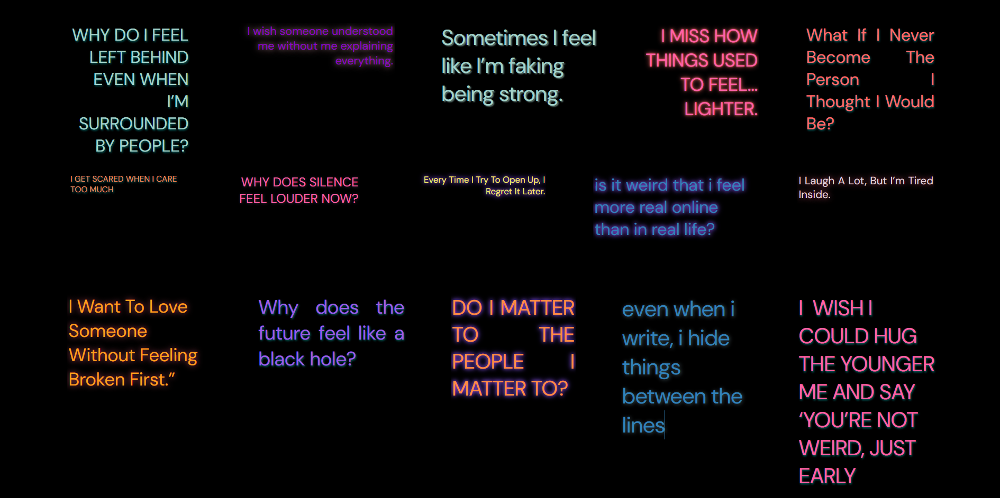

# 🖤 Thought Painting

A No Login, Secure, Simple, healing web app where you can *drop heavy thoughts* into an invisible grid, and later **see how your mind unfolded**—one thought at a time.

> “Even when I write, I hide things between the lines.”

---

## ✨ What is Thought Painting?

Thought Painting is a black-screen canvas with invisible boxes where you can freely place your thoughts—no pressure, no rules. It's for those late-night mental weight moments when you just need to **get it out**.

Every thought you add builds a **progression**, a silent story of what your mind has been carrying. Below the main 4x4 grid, there's a **"Thought Canvas"**—a bigger space where you can freely extend the layout and even create **entire new canvases**.

---

## 💡 Why I Made This

I built this while I'm still learning—just using the skills I know: HTML, CSS, JavaScript.  
No libraries, no fancy framework. Just me, trying to make something real for people like me.

It’s imperfect. It’s mine. It’s honest.  
And I hope it gives someone comfort.

---

## 🔧 Features

- 🎨 Extend the canvas size by adding new rows dynamically.
- ➕ Create **entire new canvases** to start a fresh page of thoughts.
- 📥 Download your current canvas as a **PDF**:
  - Both **portrait** and **landscape** formats supported.
- 💾 All your thoughts are stored locally (no cloud or login needed).

---

## 📦 Tech Stack

- HTML
- CSS (vanilla)
- JavaScript (vanilla)
- [jsPDF](https://github.com/parallax/jsPDF) for PDF generation

---

## 🚀 Future Ideas

- Export/share as image  
- Text sentiment heatmap mode  
- Audio whisper-to-thought mode  
- Cross-canvas memory linking  

---

## 📜 License

MIT — use it, remix it, fork it, just credit it with heart.

---

## 🤍 Final Note

This app is for those nights when typing feels easier than talking.  
When you just want to see what your brain and heart are really feeling.

If you're here... your thoughts matter. Let them out.

